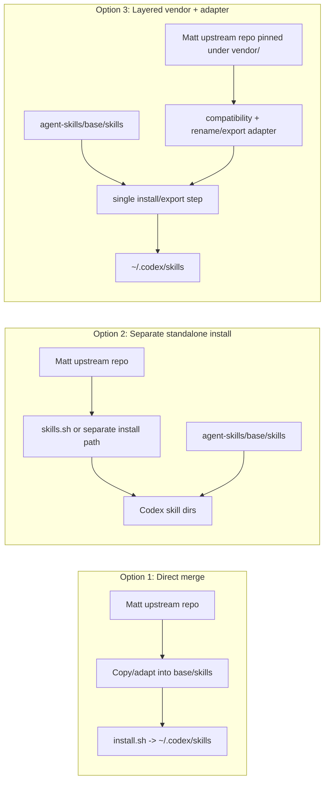

# 0001. Layer external skill packs instead of merging them into `base/skills`

- Status: proposed
- Date: 2026-07-07
- Deciders: pending
- Reversibility: one-way door

## Context and problem statement

No project ADR convention was found in this repo, so this record uses the MADR
fallback template.

We want to integrate Matt Pocock's `skills` repo into the current workflow.
This repo's current contract is that `base/skills/` is a curated,
project-agnostic source of truth that gets replicated flat into
`~/.codex/skills`, while project-specific behavior lives in each project's own
`.agents/profiles/<skill>.md`.

Matt's repo is a useful upstream skill pack, but it brings a different model:
its quickstart installs via `npx skills@latest add mattpocock/skills`, requires
running `/setup-matt-pocock-skills`, and distinguishes user-invoked and
model-invoked skills. It also overlaps with existing skill names such as
`code-review` and `handoff`, and at least some skills currently use top-level
frontmatter that Codex does not accept.

Prioritized quality attributes and weights:

- Workflow fit / discoverability (5)
- Correctness / semantic fidelity (5)
- Blast radius (5)
- Codex compatibility (5)
- Operational cost (4)
- Migration / transition cost (4)
- Reversibility (4)
- Upstream sync / evolvability (4)

## Decision drivers (hard constraints)

- `base/skills/` must remain a first-party, project-agnostic source of truth.
- The flat install model into `~/.codex/skills` must not silently replace
  existing skill names.
- We need a clean way to pull upstream Matt skill updates without manual
  re-copying across many files.
- Repo- or company-specific conventions must stay in project repos, not inside a
  shared public skill pack.
- Codex-incompatible skill metadata must be isolated behind a compatibility seam
  instead of bleeding into the curated base.

## Considered options

1. **Direct merge into `base/skills`** — copy selected Matt skills into this
   repo, normalize them, and treat them as first-party base skills.
2. **Separate standalone install** — keep Matt's repo in its own folder/repo and
   install/manage it independently from `agent-skills`.
3. **Layered vendor + adapter integration** — pin Matt's repo under a dedicated
   external namespace (for example `vendor/mattpocock/`), then expose only an
   approved subset through an explicit compatibility/export layer.

## Decision matrix

| Attribute (weight) | Option 1: direct merge | Option 2: separate standalone install | Option 3: layered vendor + adapter |
|---|---|---|---|
| Workflow fit / discoverability (5) | 3 — one control plane, but mixed philosophies make the base repo harder to reason about. | 2 — low setup effort, but users now have two skill systems and two install paths to remember. | 5 — one control plane with a clear boundary between first-party and external packs. |
| Correctness / semantic fidelity (5) | 2 — copying and rewriting skills risks changing their intended behavior. | 4 — upstream remains intact, but meaning can still drift when users combine overlapping skills ad hoc. | 4 — upstream stays pinned and intact; only the adapter layer changes semantics, in one place. |
| Blast radius (5) | 1 — any bad import lands in the source-of-truth base and can affect every machine. | 4 — isolated from the curated base, but collisions still appear if installed into the same flat skill namespace. | 4 — external skills stay outside the base; adapter/export mistakes are contained to the integration seam. |
| Codex compatibility (5) | 2 — unsupported metadata has to be rewritten directly inside copied skills. | 2 — a separate install does not solve unsupported frontmatter or slash-command assumptions. | 4 — the adapter layer is the explicit place to lint, patch, rename, or suppress incompatible skills. |
| Operational cost (4) | 2 — every upstream update becomes a manual merge and re-review exercise. | 2 — simple initially, but ongoing discovery, naming, and support are fragmented. | 4 — some setup cost, then predictable upgrades at the vendor/adapter boundary. |
| Migration / transition cost (4) | 2 — highest initial effort because each skill must be normalized before use. | 5 — fastest way to try the pack. | 3 — moderate initial work to create the boundary, but no need to rewrite all imported skills. |
| Reversibility (4) | 2 — unwinding copied skills later is noisy and error-prone. | 4 — easy to remove the standalone install. | 4 — remove the vendor subtree and adapter/export entries; `base/skills` stays clean. |
| Upstream sync / evolvability (4) | 2 — poor; copied code diverges immediately. | 4 — easy to pull updates, but hard to make them feel integrated. | 5 — best long-term balance: pin upstream cleanly while curating how it is exposed. |
| **Weighted total** | **69** | **118** | **150** |

## Diagrams

## Sensitivity & tradeoff points

- **Tradeoff:** keeping the upstream untouched improves updateability, but it
  reduces the feeling of a single native skill catalog unless we add a thin
  adapter/export layer.
- **Tradeoff:** the separate standalone install minimizes day-one effort, but it
  maximizes long-term fragmentation because naming, compatibility, and
  discoverability are left to human memory.
- **Sensitivity:** if we only want one or two Matt skills for personal use and
  do not care about central curation, Option 2 becomes acceptable.
- **Sensitivity:** if Matt's repo becomes fully Codex-native and gains a clean
  namespacing story for overlapping skills, Option 2 becomes more attractive.
- **Sensitivity:** if we decide the imported skills should be permanently
  rewritten to fit this repo's house style and we are willing to own them as
  first-party code, Option 1 becomes viable, but only after a deliberate fork
  decision.

## Decision

Choose **Option 3: layered vendor + adapter integration**.

Use `agent-skills` as the control plane, but do not merge Matt's skills into
`base/skills`. Instead, pin his repo as an external upstream and expose only a
selected, validated subset through a dedicated compatibility/export layer that
can rename overlapping skills, reject unsupported metadata, and document the
expected workflow.

## Consequences

- **We gain:** one place to manage skill curation, version pins, compatibility,
  and documentation without polluting the first-party base.
- **We give up:** the zero-effort simplicity of "just install the other repo"
  and the minimalism of a pure standalone checkout.
- **Revisit if:** we only end up using one or two non-overlapping Matt skills,
  or if his repo becomes fully Codex-native and collision-safe on its own.
- **Back-out path:** remove the vendor subtree and adapter/export layer; no
  first-party base skill has to be disentangled because `base/skills` stays
  untouched.
- **Fitness function:** add a compatibility check that fails if an exported
  external skill name collides with `base/skills`, or if the selected external
  skill uses unsupported Codex frontmatter keys.

## Review findings

The highest-risk failure mode is not technical import difficulty; it is semantic
confusion caused by overlapping names and different workflow assumptions. The
recommended option addresses that at the boundary instead of inside the skill
implementations.
